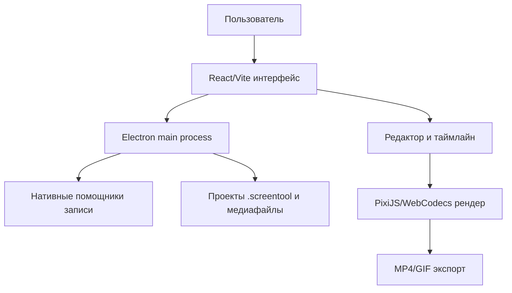

# ScreenTool

**ScreenTool** — настольное приложение для записи экрана и подготовки аккуратных демонстрационных видео.


---

## 🎯 Что это такое

ScreenTool записывает экран, микрофон, системный звук и веб-камеру, а затем сразу открывает редактор. В нём можно обрезать видео, добавить зумы, оформить фон, настроить курсор, наложить веб-камеру и экспортировать результат в MP4 или GIF.

Приложение полезно для:

- записи уроков и инструкций;
- демонстрации продукта;
- быстрых видео для Telegram, YouTube, курсов и презентаций;
- аккуратных скринкастов без отдельного видеоредактора.

---

## ✨ Возможности

| Возможность | Что даёт |
|---|---|
| 🎥 Запись экрана | Захват всего экрана или отдельного окна |
| 🎙️ Звук | Запись микрофона и системного аудио, где это поддерживает система |
| 🖱️ Курсор | Сглаживание движения, настройка размера, эффекты клика |
| 🔍 Зумы | Ручные и автоматические приближения по движению курсора |
| 👤 Веб-камера | Круглая или прямоугольная камера поверх записи |
| ✂️ Таймлайн | Обрезка, ускорения, замедления, аннотации и дополнительные аудио-фрагменты |
| 🖼️ Оформление | Обои, цвета, градиенты, рамки, скругления, тени и соотношения сторон |
| 📦 Экспорт | MP4 для видео и GIF для коротких анимаций |
| 💾 Проекты | Сохранение работы в `.screentool`, чтобы вернуться к монтажу позже |

---

## 🚀 Запуск из исходников

### Требования

- Node.js и npm
- macOS, Windows или Linux
- Для macOS: Xcode Command Line Tools
- Для Windows: Visual Studio Build Tools с C++ и CMake
- Для Linux: системные библиотеки сборки и захвата экрана

### Быстрый старт

```bash
npm install && npm run dev
```

### Сборка приложения

```bash
npm run build
```

Отдельные сборки:

```bash
npm run build:mac
npm run build:win
npm run build:linux
```

---

## 🧭 Как пользоваться

1. Запусти ScreenTool.
2. Выбери экран или окно.
3. Настрой микрофон, системный звук и веб-камеру.
4. Нажми запись.
5. Останови запись — откроется редактор.
6. Обрежь лишнее, добавь зумы, оформи кадр.
7. Экспортируй MP4 или GIF.

Проект можно сохранить в файл `.screentool`. Это файл с настройками монтажа и ссылкой на исходное видео.

---

## ⚙️ Архитектура



### Основные части

| Часть | Зачем нужна |
|---|---|
| `electron/` | Окна приложения, меню, доступ к файлам, запись, экспорт, обновления |
| `src/` | Интерфейс: экран записи, редактор, таймлайн, настройки |
| `electron/native/` | Нативные помощники для macOS/Windows и ускоренного экспорта |
| `public/wallpapers/` | Встроенные фоны для оформления видео |
| `public/app-icons/` | Иконки приложения в интерфейсе |
| `docs/` | Локальные заметки и медиа для документации |

### Как идёт запись

- Electron управляет окнами и разрешениями системы.
- macOS использует ScreenCaptureKit.
- Windows использует Windows Graphics Capture и WASAPI-аудио.
- Linux использует возможности захвата Electron; системный звук обычно зависит от PipeWire.

### Как работает редактор

- Видеофайл остаётся исходником.
- Все правки сохраняются как состояние проекта.
- Таймлайн хранит обрезки, зумы, аннотации, аудио и настройки веб-камеры.
- При экспорте ScreenTool заново собирает финальный кадр и сохраняет MP4 или GIF.

---

## 🧪 Проверки

```bash
npm run i18n:check
npm test
npm run lint
```

Для точечных тестов:

```bash
npx vitest --run path/to/file.test.ts
```

---

## ⚠️ Ограничения

- На macOS для записи экрана, микрофона и камеры нужны системные разрешения.
- На Linux скрытие системного курсора может работать хуже, чем на macOS и Windows.
- Автообновления выключены по умолчанию. Для своего канала обновлений нужны `SCREENTOOL_UPDATE_FEED_URL` и `SCREENTOOL_ENABLE_AUTO_UPDATES=1`.
- Старые проекты `.recordly` после полного ребрендинга не считаются поддерживаемым форматом. Новый формат — `.screentool`.

---

## 📦 Репозиторий

Текущий репозиторий проекта:

https://github.com/ungurenko/screen-tool

Ошибки и идеи можно фиксировать в Issues этого репозитория.

---

## 📄 Лицензия и происхождение

ScreenTool распространяется по лицензии **AGPL-3.0**.

Проект сделан на базе open-source приложения **Recordly**. Упоминания лицензии и происхождения сохранены, потому что это важно для корректного использования исходного кода.
